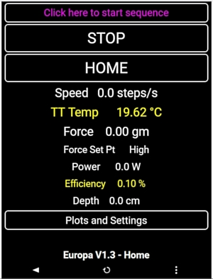
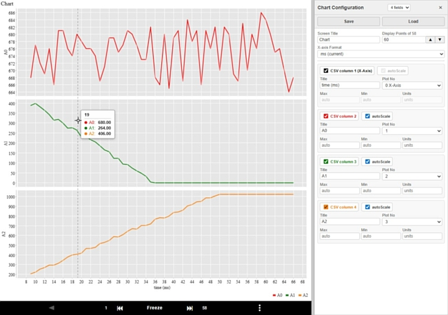

# pfodWeb / pfodProxy source repository

 &nbsp;&nbsp;&nbsp; 

pfodWeb.html is a [pfod protocol](https://www.pfod.com.au/) client for controlling and monitoring Arduino, ESP32, 
and other embedded devices from a browser — no app install, no internet, server access required. pfodWeb renders device-defined drawings, menus, 
and charts, and talks to devices directly via HTTP and via Serial, BLE and TCP/IP using the **pfodProxy** bridge.

The minimal Arduino [pfodParser library](https://github.com/drmpf/pfodParser) provides the device side support to display GUI's on pfodWeb and also the Android 
[pfodApp](https://www.pfod.com.au/)

pfodWeb includes a built-in Designer that lets you create menus and sub-meus of buttons, sliders and charts. pfodWeb charts include data logging and formatting options.   
See the tutorials at [pfodDesigner](https://www.forward.com.au/pfod/pfodDesigner/index.html)

pfodWeb is distributed as a single, self-contained HTML file (all JS/CSS/fonts inlined) so it can be opened directly in an off-line browser. 
It can also be served from the microprocessor itself for complete off-line stand alone deployment.

## Repository Layout

| Path | Description |
|---|---|
| `pfodWeb_src/` | JavaScript/HTML/CSS source for pfodWeb. **Edit here** — never edit the built HTML files directly. |
| `pfodProxy_rs/` | Rust source for pfodProxy, the HTTP-to-device proxy (serial / TCP / BLE) that pfodWeb talks to for those connections. |
| `data/` | Compressed (`.gz`) files to be served from the microprocessor's file system for stand alone deployment. |
| `extraFonts/` | Optional supplementary font subsets (Cyrillic, Greek, etc.) loadable without rebuilding pfodWeb. |
| `variants/` | Board definitions (`arduino/`, `esp32/`, etc) for designer, bundled in pfodWeb.html by the build. |
| `docs/` | User guides and licensing documentation — see [docs/index.html](docs/index.html). |
| `pfodWeb/` | The built pfodWeb.html and extraFonts. This is the same for all browsers and operating systems |
| `windows/`, `linux/`, `macOS/` | Platform-specific pfodProxy, produced by the build scripts below. |

## Building

Each platform has a top-level build script that compiles `pfodProxy` (Rust).   
There is also a build for `pfodWeb.html` that is common to all platforms:

| Platform | Script | Output |
|---|---|---|
| Windows | `windows-build.bat` | `windows/` |
| Linux | `build-linux.bat` | `linux/` |
| macOS | `build-macOSApp.sh` | `macOS/` |
| all | `build-pfodWeb.bat / .sh` | `pfodWeb/` |

Building pfodProxy requires the [Rust toolchain](https://rustup.rs/) (`cargo`).  
The macOS build is packaged as an installable app. See the detailed [macOS install instructions](https://www.forward.com.au/pfod/pfodWeb/pfodProxy/macOS/allow-pfodProxy-macOS.html).

To build the device-served `data/` bundle (served from microprocessor itself for stand alone deployment).   
use `build_data.bat / .sh`  

## Documentation

pfodWeb user documentation is in [`docs/`](docs/index.html):

- [pfodWeb User Guide](docs/pfodWeb-guide.html) — connecting, interface layout, toolbar, plotting CSV data.
- [pfodWeb Chart Mode Guide](docs/pfodWeb-chart-mode-guide.html) — chart display, raw message viewer, field customization.
- [pfodWeb extraFonts Guide](docs/pfodWeb-extraFonts-guide.html) — adding font subsets without rebuilding.
- [Comparison](docs/Comparision.html) — pfodWeb vs. other Arduino remote-control approaches.
- [License](docs/pfodWeb_pfodProxy_License.html) / [Rust Third-Party Licenses](docs/RustThirdPartyLicenses.html)

For pfodWeb Designer see the tutorials at [pfodDesigner](https://www.forward.com.au/pfod/pfodDesigner/index.html)

## License

(c) Forward Computing and Control Pty. Ltd. See [docs/pfodWeb_pfodProxy_License.html](docs/pfodWeb_pfodProxy_License.html) for full terms; pfodProxy's third-party Rust crate licenses are listed in [docs/RustThirdPartyLicenses.html](docs/RustThirdPartyLicenses.html).
