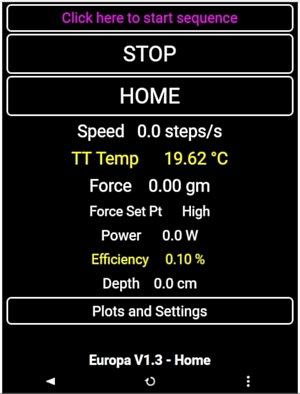
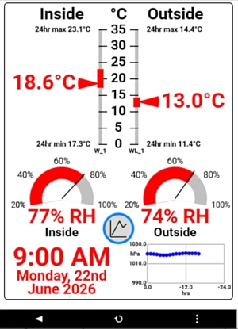
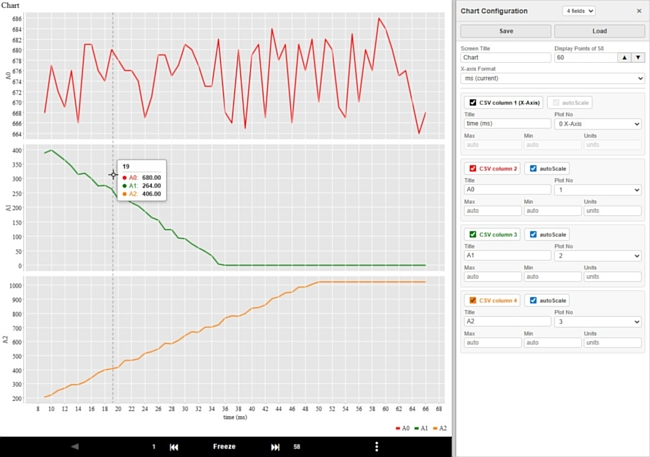

# pfodWeb / pfodProxy source repository

 &nbsp;&nbsp;&nbsp; 

pfodWeb.html is a [pfod protocol](https://www.pfod.com.au/) designer, code generator and client for controlling and monitoring Arduino and other embedded devices from a browser — 
no app install, no internet, server access required. pfodWeb.html renders device-defined drawings, menus, 
and charts, and talks to devices via Serial, BLE and TCP/IP and HTTP, using the [pfodProxy](https://www.forward.com.au/pfod/pfodWeb/pfodWeb_startup.html) as a bridge if the browser
does not support the connection natively.

The designer / code generator includes pinouts for over 600 boards for connecting the controls directly to the board's I/O.

The Arduino [pfodParser library](https://github.com/drmpf/pfodParser) provides the device side support to display GUI's on pfodWeb.

pfodWeb is distributed, with the Arduino pfodParser library, as a single, self-contained HTML file (all JS/CSS/fonts inlined) so it can be opened directly
 in an off-line browser. 
It can also be served from the microprocessor itself for complete off-line stand alone deployment.

There is also an Android client, [pfodApp](https://www.forward.com.au/pfod/index.html)

## Designer Tutorials

pfodWeb includes a built-in Designer that lets you create menus and sub-meus of buttons, sliders, charts and interactive dwgs. pfodWeb charts include data logging and formatting options.   

- [Designing menus / sub-menus and charts](https://www.forward.com.au/pfod/ArduinoProgramming/DataDisplay/index.html) – uses Arduino UNO
- [Charting Streaming Raw CSV data](https://www.forward.com.au/pfod/pfodWeb/Charting/index.html) – no menu or pfodParser needed, uses Pi-Pico in examples, but also works with Arduino UNO or higher via Serial
- [pfodWeb Dwg Designer GUI Tutorials](https://www.forward.com.au/pfod/pfodWeb/Designer/index.html) – designs interactive GUI's, uses Arduino Mega or higher. The simple examples also work with Arduino UNO

## Documentation

pfodWeb user documentation is in [`docs/`](docs/index.html):

- [pfodWeb User Guide](docs/pfodWeb-guide.html) — connecting, interface layout, toolbar, plotting CSV data.
- [pfodWeb Chart Mode Guide](docs/pfodWeb-chart-mode-guide.html) — chart display, raw message viewer, field customization.
- [pfodWeb extraFonts Guide](docs/pfodWeb-extraFonts-guide.html) — adding font subsets without rebuilding.
- [Comparison](docs/Comparision.html) — pfodWeb vs. other Arduino remote-control approaches.
- [Arduino Example Sketches](examples/README.md) — the eight example sketches, which micros each compiles for, and how to connect to them.
- [License](docs/pfodWeb_pfodProxy_License.html) / [Rust Third-Party Licenses](docs/RustThirdPartyLicenses.html)

## Repository Layout

| Path | Description |
|---|---|
| `pfodWeb_src/` | JavaScript/HTML/CSS source for pfodWeb. **Edit here** — never edit the built HTML files directly. |
| `pfodProxy_rs/` | Rust source for pfodProxy, the HTTP-to-device proxy (serial / TCP / BLE) that pfodWeb talks to for those connections. |
| `data/` | Compressed (`.gz`) files to be served from the microprocessor's file system for stand alone deployment. |
| `extraFonts/` | Optional supplementary font subsets (Cyrillic, Greek, etc.) loadable without rebuilding pfodWeb. |
| `variants/` | Board definitions (`arduino/`, `esp32/`, etc) for designer, bundled in pfodWeb.html by the build. |
| `docs/` | User guides and licensing documentation — see [docs/index.html](docs/index.html). |
| `examples/` | Arduino example sketches (Serial / BLE / TCP/IP / HTTP) that pfodWeb connects to — see [examples/README.md](examples/README.md). |
| `pfodWeb/` | The built pfodWeb.html and extraFonts. This is the same for all browsers and operating systems |
| `windows/`, `linux/`, `macOS/` | Platform-specific pfodProxy, produced by the build scripts below. |

## Building

There one build for `pfodWeb.html` that is common to all platforms:

Each platform also has a top-level build script that compiles `pfodProxy` (Rust).   

| Platform | Script | Output |
|---|---|---|
| all | `build-pfodWeb.bat / .sh` | `pfodWeb/` |
| Windows | `windows-build.bat` | `windows/` |
| Linux | `build-linux.bat` | `linux/` |
| macOS | `build-macOSApp.sh` | `macOS/` |

Building pfodProxy requires the [Rust toolchain](https://rustup.rs/) (`cargo`).  
The macOS build is packaged as an installable app. See the detailed [macOS install instructions](https://www.forward.com.au/pfod/pfodWeb/pfodProxy/macOS/allow-pfodProxy-macOS.html).

To build the device-served `data/` bundle (served from microprocessor itself for stand alone deployment).   
use `build_data.bat / .sh`  

## License

(c) Forward Computing and Control Pty. Ltd. See [docs/pfodWeb_pfodProxy_License.html](docs/pfodWeb_pfodProxy_License.html) for full terms; pfodProxy's third-party Rust crate licenses are listed in [docs/RustThirdPartyLicenses.html](docs/RustThirdPartyLicenses.html).
